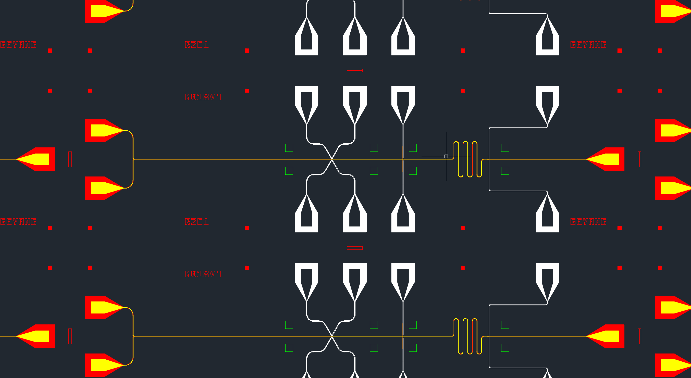

# M018_Yggdrasil
Yggdrasil is our newest generation single electron quantum bit experiment.
This project is a collaboration between **Ge Yang** ([@episodeyang](https://github.com/episodeyang))
and **Gerwin Koolstra** ([@gkoolstra](https://github.com/gkoolstra)) at the University of Chicago.

The `simulations` folder contains several files that help us with the simulation of our sample. Please note: 
- `.aedt` files are created using Ansys Electronics Desktop 2015.
- `.mxwl` files are created by Ansys Maxwell 2015.

Please do not convert these files to later versions of Ansys software and then commit. These files are usually not backwards compatible.

The `mask` folder contains versioned mask script and 
mask `dxf` files. Here is an example of our design:

## References
More information can be found in the following theses and papers.
- [Ge Yang's PhD Thesis](https://knowledge.uchicago.edu/record/2199?ln=en)
- [Coupling an Ensemble of Electrons on Superfluid Helium to a Superconducting Circuit](https://journals.aps.org/prx/abstract/10.1103/PhysRevX.6.011031)
- [Gerwin Koolstra's PhD Thesis](https://knowledge.uchicago.edu/record/2070?ln=en)
- [Coupling a single electron on superfluid helium to a superconducting resonator](https://www.nature.com/articles/s41467-019-13335-7)

